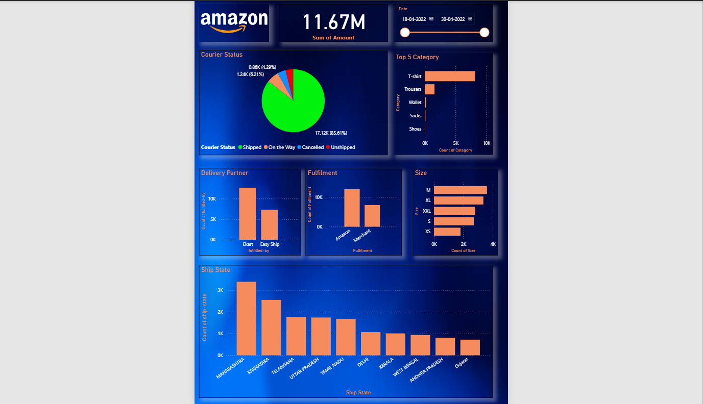

# 📦 Amazon Sales Analysis Dashboard | Power BI

An interactive **Power BI Dashboard** developed to analyze Amazon sales data and uncover meaningful business insights. It provides a comprehensive overview of courier performance, product categories, fulfillment methods, delivery partners, product sizes, and the geographical distribution of orders.

> 📅 **Analysis period:** 18 April 2022 – 30 April 2022 · 💰 **Total Sales:** ₹11.67M

---

## 📌 Project Overview

This Power BI dashboard transforms raw Amazon sales data into meaningful visualizations, helping businesses monitor sales operations, shipping performance, and customer purchasing trends. It is designed to answer key business questions around logistics, product demand, and order fulfillment — all on a single interactive page.

---

## 📈 Dashboard Preview



---

## 📊 Dashboard Sections & Insights

### 💰 Total Sales
- **₹11.67M** total sales amount for the selected period, with a dynamic date slicer.

### 🚚 Courier Status
Distribution of orders by delivery status.
- **Shipped: 17.12K (85.61%)** — the vast majority of orders
- **On the Way: 1.24K (6.21%)**
- **Cancelled: 0.86K (4.29%)**
- Remaining orders **Unshipped**

### 👕 Top 5 Product Categories
- **T-shirt** is the clear best-seller (~10K orders), well ahead of **Trousers**
- Followed by **Wallet**, **Socks**, and **Shoes**

### 🚛 Delivery Partners
- **Ekart** handles the most shipments (~12K), roughly **1.7× more** than **Easy Ship** (~7K)

### 📦 Fulfillment Analysis
- **Amazon-fulfilled** orders (~12K) outweigh **Merchant-fulfilled** orders (~7K)

### 📏 Product Size Analysis
- **M (Medium)** is the most ordered size, followed by **XL** and **XXL**
- **XS** sees the least demand — useful for inventory planning

### 🗺️ Ship State Analysis
- **Maharashtra** leads all states (~3.2K orders), followed by **Karnataka** (~2.5K)
- Then **Telangana, Uttar Pradesh, Tamil Nadu, Delhi, Kerala, West Bengal, Andhra Pradesh** and **Gujarat**

---

## 🛠️ Tools & Technologies

- Microsoft Power BI
- Power Query (data cleaning & transformation)
- DAX (Data Analysis Expressions)
- Data Modeling
- Interactive Visualizations

---

## 📊 Features

Interactive dashboard · Dynamic date filter · KPI cards · Pie & bar charts · Cross filtering · Business insights · Clean, professional UI

---

## 📁 Repository Structure

```
Amazon-Sales-Dashboard/
│
├── README.md
├── LICENSE
├── Dashboard/
│   └── Amazon Sales Dashboard.pbix     # Power BI report file
├── Dataset/
│   └── Amazon_Sales_Data.xlsx          # Source dataset
├── Images/
│   └── dashboard.png                   # Dashboard screenshot
└── docs/
    └── dashboard_overview.pdf          # Dashboard exported to PDF
```

---

## 📌 Business Questions Answered

- What is the total sales amount for the period?
- What percentage of orders were successfully shipped?
- Which product categories receive the most orders?
- Which delivery partner handles the most shipments?
- Which fulfillment method (Amazon vs Merchant) is used most?
- Which product size is most popular among customers?
- Which states generate the highest number of orders?
- How are orders distributed across courier statuses?

---

## 📈 Key Dashboard KPIs

Total Sales Amount · Courier Status Distribution · Top Product Categories · Delivery Partner Performance · Fulfillment Analysis · Product Size Distribution · Ship State Distribution

---

## 💡 Key Insights

- **85.61%** of all orders were successfully shipped — strong delivery performance.
- **T-Shirts** are the highest-selling product category by a wide margin.
- **Amazon Fulfillment** processed the majority of orders over Merchant fulfillment.
- **Ekart** significantly out-delivered Easy Ship as a courier partner.
- **Medium (M)** sized products recorded the highest demand.
- **Maharashtra** contributed the most shipped orders among all states.

---

## 🚀 Future Improvements

Monthly & yearly sales trends · Revenue forecasting · Customer segmentation · Product profitability analysis · Return & refund analysis · Interactive geographic maps · Sales trend prediction

---

## 👨‍💻 Author

**Tejus Pandey**

- 💼 LinkedIn: https://www.linkedin.com/in/tejuspandey
- 🐙 GitHub: https://github.com/tejus23

---

## ⭐ If you found this project useful, consider giving it a star!
